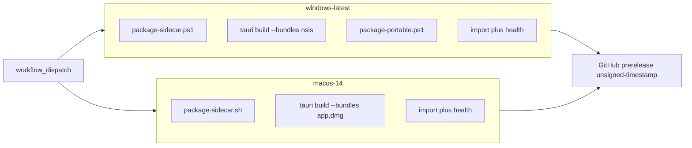

# macOS packaging plan

Agreed design for packaging Deep Agent as an **unsigned arm64 macOS `.dmg`**, with
dual-OS GitHub Actions producing Windows + Mac artifacts. Complements
[tauri-migration.md](./tauri-migration.md) (Windows Phase 0–3 complete).

**Status:** Decision record agreed. Implementation tracks this document.

---

## Decision record

| # | Topic | Choice |
|---|--------|--------|
| 1 | Ambition | Direct-download shaped (DMG); **unsigned** on all platforms for now |
| 2 | CPU | Apple Silicon only (`arm64`) |
| 3 | Mac artifact | `.dmg` only |
| 4 | Signing / notarization | Deferred |
| 5 | Sidecar Python | Relocatable CPython (`uv` / python-build-standalone) under `sidecar/` |
| 6 | Build | Dual-OS GitHub Actions (`windows-latest` + `macos-14`) |
| 7 | Scripts | Parallel `package-sidecar.ps1` + `package-sidecar.sh` |
| 8 | Bundle targets | CLI `--bundles nsis` (Win) / `--bundles app,dmg` (Mac; `app` required for updater `.app.tar.gz`) |
| 9 | CI trigger | Smoke: `workflow_dispatch`. Ship: push tag `vX.Y.Z` |
| 10 | Entitlements | Research + wire Hypervisor-related entitlements before Mac package is “done” |
| 11 | Licenses | Parallel track (not blocking green CI); gate before public share — see [LICENSES.md](./LICENSES.md) |
| 12 | Windows CI | NSIS + portable zip |
| 13 | UX | Platform menu label + macOS degraded virt copy |
| 14 | Unix sidecar stop | `process_group(0)` + group `SIGKILL` |
| 15 | CI smoke | `from deep_agent.api.app import app` + brief `/health` |
| 16 | Min macOS | `11.0` (matches microsandbox `macosx_11_0_arm64` wheel) |
| 17 | Releases | Smoke prerelease `unsigned-YYYYMMDD-HHMM`; ship release from tag `vX.Y.Z` (latest) |
| 18 | Docs | This file + Phase 5 stub in `tauri-migration.md` |
| 19 | Version | CI injects semver from git tag on ship builds |
| 20 | Auto-update | Single-track Tauri updater (OS-unsigned; Tauri-signed); floor `v0.2.0` |
| 21 | Linux | Out of scope; next phase after Mac |

**Release assets (ship tags):**

| Asset | Platform / role |
|-------|-----------------|
| `Deep-Agent-X.Y.Z-windows-x64-setup.exe` | Windows NSIS (update-eligible) |
| `Deep-Agent-X.Y.Z-windows-x64-portable.zip` | Windows portable (download-only) |
| `Deep-Agent-X.Y.Z-macos-arm64.dmg` | macOS arm64 |
| `Deep-Agent-X.Y.Z-windows-x64-setup.nsis.zip` (+ `.sig`) | Windows updater artifact |
| `Deep-Agent-X.Y.Z-macos-arm64.app.tar.gz` (+ `.sig`) | macOS updater artifact |
| `latest.json` | Updater manifest (`…/releases/latest/download/latest.json`) |

**Deferred:** notarization, App Store, Intel/universal Mac, Linux installers,
license hard-gate, update *channels*, custom DMG artwork.

---

## Architecture



**Packaged Mac process model** (same as Windows):

| Direction | Method |
|-----------|--------|
| WebView → FastAPI | HTTP REST + SSE on `127.0.0.1` |
| Rust → FastAPI | Health wait, then navigate WebView |
| Rust → Python | Spawn `$RESOURCE/sidecar/bin/python3 -m uvicorn` |
| Data dirs | `~/Library/Application Support/DeepAgent`, `~/Documents/DeepAgent/workspace` |

---

## Local / CI commands

```bash
# macOS (Apple Silicon)
pnpm package:sidecar          # scripts/package-sidecar.sh
pnpm build:release            # sidecar + tauri build --bundles app,dmg

# Windows
pnpm package:sidecar          # scripts/package-sidecar.ps1
pnpm build:release            # sidecar + --bundles nsis + portable zip
```

CI: Actions → **Desktop build (unsigned)** → Run workflow. Downloads appear on the
prerelease tagged `unsigned-YYYYMMDD-HHMM`.

**Unsigned Gatekeeper note:** macOS will warn or block unknown developers. For
internal testing, right-click → Open, or clear quarantine after verifying the
artifact. Notarization is required before normal public distribution.

---

## Entitlements

`src-tauri/Entitlements.plist` is wired for Hypervisor / bundled native libs
(microsandbox `msb` + libkrunfw). Entitlements apply fully when the app is
code-signed; they are still configured now so CI DMGs match the intended
capability set.

Do **not** enable App Sandbox (conflicts with microVM + sidecar).

---

## Manual Apple Silicon check

After downloading the unsigned DMG from a CI prerelease:

1. Open the DMG and copy Deep Agent to Applications (or run from the volume).
2. Clear quarantine if needed: `xattr -dr com.apple.quarantine "/Applications/Deep Agent.app"`.
3. Launch; confirm WebView reaches `/health` and the Vue UI loads.
4. With OpenRouter configured, confirm chat works; sandbox should create a VM on
   Apple Silicon with Hypervisor, or show platform-aware degraded copy.
5. Quit and confirm no leftover `uvicorn` / Python sidecar processes.

---

## Auto-update

Single-track in-app updater (no stable/beta channels). OS code signing remains
deferred; updates are integrity-checked with a **Tauri updater keypair**.

| Item | Detail |
|------|--------|
| Endpoint | `https://github.com/pvanand07/deepagent-assistant/releases/latest/download/latest.json` |
| Ship trigger | Push tag `vX.Y.Z` → [`.github/workflows/desktop-release.yml`](../.github/workflows/desktop-release.yml) |
| Smoke CI | Keep [desktop-build.yml](../.github/workflows/desktop-build.yml) prereleases; updater ignores them |
| Floor | `v0.2.0` — installs before that need a **one-time manual** download |
| UX | Quiet check on launch + Settings → About → Check for updates; Later snoozes 7 days |
| Dev | Disabled when `debug_assertions` (`tauri dev`) |
| Artifacts | NSIS + macOS app update-eligible; portable zip is download-only |

**Secrets (repo):** set `TAURI_SIGNING_PRIVATE_KEY` (required) and optional
`TAURI_SIGNING_PRIVATE_KEY_PASSWORD`. Generate once with
`pnpm tauri signer generate -w src-tauri/updater.key` — keep the private key out
of git (gitignored); the public key is embedded in `src-tauri/tauri.conf.json`.

---

## Next phase (Linux)

Linux AppImage/deb + relocatable Linux CPython sidecar and KVM-oriented degraded
UX are explicitly out of scope here. Track as a follow-on after Mac packaging is
stable.
