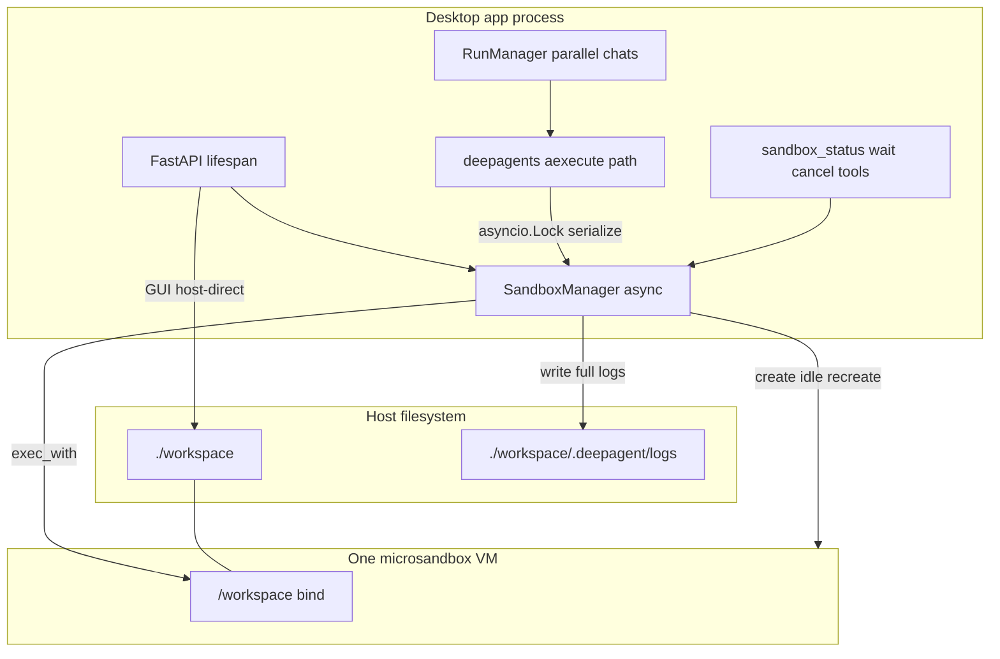

# Microsandbox migration plan

Agreed design for replacing bubblewrap with [microsandbox](https://github.com/superradcompany/microsandbox).  
Python SDK reference: [sdk-python.md](https://github.com/superradcompany/skills/blob/main/microsandbox/references/sdk-python.md).

**Status:** Implemented in source (see README). Guest image still needs a local
`docker build -f Dockerfile.sandbox` (or registry pull) before running with a real VM.

---

## Decision record

| Topic | Choice |
|--------|--------|
| Backend | Hard-replace bubblewrap with microsandbox |
| Topology | One shared sandbox for the whole app |
| Workspace | Bind-mount host workdir at `/workspace` (full tree, all chats) |
| Network | App-wide only; `false` → `Network.none()`, `true` → `Network.public_only()`; drop per-chat network |
| Deploy | Native desktop (Win/Mac/Linux); remove Docker packaging |
| Guest image | Custom `Dockerfile.sandbox` + env override; dev = local build, release = registry pull |
| Concurrency | Serialize execs; agent sees busy; wait by default; agent sets wait time; ask user before cancel |
| Lock tools | `sandbox_status`, `sandbox_wait`, `cancel_sandbox_holder` (cancels holding run) |
| Lifecycle | Create at startup; `idle_timeout` (default 300s, env override, `0` = off); recreate on next use; `replace=True` |
| Resources | Default 1024 MiB / 2 CPUs + env overrides |
| Async bridge | Native async on app loop; override `aexecute` (+ async upload/download); sync only for CLI/tests |
| Workdir API | Single app workspace; no per-chat host root |
| Virt failure | Fail hard at startup with fix-it guidance |
| Exec I/O | Agent sets command timeout; tool result = last 100 lines; full log on disk + retention |
| File/GUI I/O | Host-direct upload/download + GUI; VM for exec-backed tools |
| Secrets | None in guest (v1) |
| Tests | Stubs by default; optional `DEEPAGENT_MSB_INTEGRATION=1` real-VM tests |

### Defaults

| Knob | Default |
|------|---------|
| Sandbox name | `deepagent` |
| Image (default) | `python:3.12-slim` (public); custom via `DEEPAGENT_SANDBOX_IMAGE` |
| Memory / CPUs | 1024 MiB / 2 |
| Idle timeout | 300s (`0` disables) |
| Lock wait | 120s (agent-configurable) |
| Exec timeout | 120s (agent-configurable; `0` = no limit) |
| Tool stdout/stderr preview | Last 100 lines |
| Full logs | `/workspace/.deepagent/logs/<id>.log` |
| Log retention | 7 days and/or ~100 MB cap |
| Network | Off → `Network.none()` |

### Env overrides (planned)

- `DEEPAGENT_WORKDIR`
- `DEEPAGENT_NETWORK_ACCESS`
- `DEEPAGENT_SANDBOX_IMAGE`
- `DEEPAGENT_SANDBOX_MEMORY`
- `DEEPAGENT_SANDBOX_CPUS`
- `DEEPAGENT_SANDBOX_IDLE_TIMEOUT`
- `DEEPAGENT_SANDBOX_LOCK_WAIT`
- `DEEPAGENT_EXEC_TIMEOUT`
- `DEEPAGENT_MSB_INTEGRATION` (tests)

---

## Why this shape

- **Desktop + microsandbox** needs host virtualization (KVM / WHP / Hypervisor.framework). Nesting inside Docker is unreliable on Win/Mac; Docker app packaging is removed in this migration.
- **One VM** matches today’s shared `./workspace` and avoids N microVMs on a laptop.
- **Serialize execs** avoids concurrent shell races on one guest; agent waits by default and only cancels another run after asking the user.
- **deepagents** already calls `aexecute` from async middleware; overriding `aexecute` on the app loop avoids double-bridging (`to_thread` → second loop).
- **Last 100 lines + log file** keeps model context small while preserving full output for `read_file`.

---

## Architecture

---

## Implementation plan

### 1. `SandboxManager` (async, app-scoped)

- Live on the FastAPI event loop.
- Startup: ensure microsandbox runtime; fail hard if virtualization/runtime unavailable.
- `Sandbox.create(name="deepagent", replace=True, image=..., memory=..., cpus=..., idle_timeout=..., volumes={"/workspace": Volume.bind(workdir)}, network=...)`.
- Lazy recreate after idle stop.
- `asyncio.Lock` around exec; track holder `(session_id, run_id)`.
- Configurable lock wait; structured busy result on timeout.
- `cancel_sandbox_holder` → cancel holding run via `RunManager`.

### 2. `MicrosandboxSandbox(BaseSandbox)`

- Replace [`src/bubblewrap_sandbox.py`](../src/bubblewrap_sandbox.py).
- Override `aexecute` (hot path); sync `execute` for CLI/tests only.
- Command timeout via `exec_with` / equivalent.
- Write full combined output to `.deepagent/logs/`; return last 100 lines + log path.
- Host-direct `upload_files` / `download_files`.
- Shared instance for all chats (not per-session VM).

### 3. App wiring

- [`src/api.py`](../src/api.py): lifespan owns manager start/stop.
- [`src/sessions.py`](../src/sessions.py): inject shared backend; session cleanup does not destroy the VM.
- [`src/agent.py`](../src/agent.py): swap backend; add lock tools; update system prompt (VM, logs, lock wait/cancel, network).
- API models: remove per-chat network and per-chat host workdir root.

### 4. Guest image

- Add `Dockerfile.sandbox` (`python:3.12-slim` + git, curl, ripgrep, essentials).
- Dev: `docker build -f Dockerfile.sandbox -t deepagent-workspace:dev .`
- Release (later): CI push + pin `DEEPAGENT_SANDBOX_IMAGE` to registry tag/digest.

### 5. Remove Docker app packaging

- Remove supported use of app `Dockerfile` / `docker-compose.yml` / bwrap `security_opt` / `BWRAP_SETUID`.
- Rewrite README and sandboxing docs for native microsandbox.

### 6. Dependencies

- Add `microsandbox` to `requirements.txt`.
- Drop bubblewrap as a runtime OS dependency.

### 7. Tests

- Keep `StubSandbox` for default API/E2E.
- Optional integration tests when `DEEPAGENT_MSB_INTEGRATION=1` and virt is available.

---

## Out of scope (v1)

- Per-chat VMs or git-worktree isolation
- Injecting secrets into the guest
- Registry publish CI (document only)
- Docker + KVM server deployment path

---

## Industry context (concurrency)

Claude Code / Codex / Cursor use OS process sandboxes (Seatbelt / bubblewrap / Landlock) per command around a workspace, and isolate **parallel** sessions with separate working trees (e.g. git worktrees)—not one shared microVM with a mutex.

This project chooses a **stronger** boundary (one microVM) and a **shared** workspace (like today’s Docker bind). Serialization + agent wait/cancel is the concurrency control that fits that choice.

---

## Implementation todos

1. Add async `SandboxManager` (create/idle/recreate, lock, logs, fail-hard startup).
2. Implement `MicrosandboxSandbox` with `aexecute` override + host-direct upload/download.
3. Wire lifespan, agent, sessions; shared backend; API cleanup; lock tools + prompts.
4. Add `Dockerfile.sandbox` + image env docs.
5. Remove Docker/bwrap packaging; update README and sandboxing docs.
6. Update stubs; add optional integration tests.
