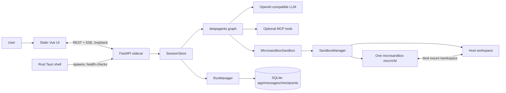
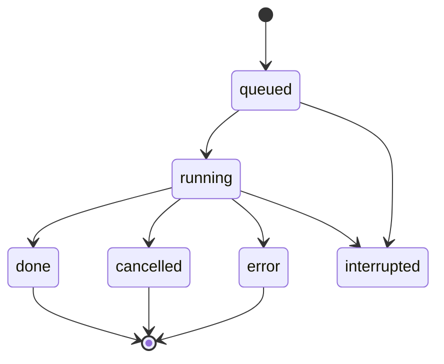

# Deep Agent architecture blueprint

This document is the implementation blueprint for rebuilding Deep Agent: a
local desktop coding agent with a FastAPI sidecar, a static Vue UI, a Tauri
shell, durable chat runs, and a shared microsandbox microVM.

It describes the intended behavior and contracts, not a dependency-by-dependency
copy of the current implementation.

## 1. Product contract

Deep Agent is a single-user desktop application that:

- chats with an OpenAI-compatible tool-calling LLM;
- gives the model file and shell tools rooted at one host workspace;
- executes shell commands in one app-wide microsandbox microVM;
- persists conversations, run events, and LangGraph checkpoints locally;
- streams each chat run over resumable server-sent events (SSE);
- works in browser development mode and as a Tauri desktop application;
- continues in degraded chat-only mode when virtualization is unavailable.

### Non-negotiable constraints

1. The browser-facing HTTP server listens on loopback only.
2. Shell execution never silently falls back to host execution in production.
3. All sessions share one workspace and one VM; shell commands are serialized.
4. File transfer is host-direct because bind-mounted guest file I/O is unreliable
   on Windows WHP. Guest shell execution remains inside the VM.
5. A chat run survives SSE client disconnection; only explicit cancellation
   stops it.
6. The UI is static HTML/CSS/JS, with no frontend build step.

## 2. Repository layout

```text
.
├── src/
│   └── deep_agent/
│       ├── api/
│       │   ├── app.py                 # FastAPI app, lifespan, HTTP routes
│       │   └── models.py              # Pydantic request/response shapes
│       ├── chat/
│       │   ├── messages.py            # UI-safe message serialization and summary
│       │   ├── runs.py                # Background run execution and event fan-out
│       │   ├── sessions.py            # Agent hydration and session lifecycle
│       │   └── streaming.py           # LangGraph stream → structured events
│       ├── integrations/
│       │   ├── mcp.py                 # MCP config discovery and tool loading
│       │   └── model_provider.py      # OpenRouter/Ollama/custom model creation
│       ├── persistence/
│       │   └── database.py            # Three async SQLite stores
│       ├── sandbox/
│       │   ├── backend.py             # deepagents BaseSandbox adapter
│       │   ├── config.py              # env, paths, settings persistence
│       │   ├── env.py                 # side-effect-free environment parsing
│       │   ├── manager.py             # VM lifecycle, lock, exec streaming, logs
│       │   ├── paths.py               # workspace containment primitive
│       │   └── tools.py               # lock-status/wait/cancel agent tools
│       ├── diagnostics/               # optional debug/export scripts
│       ├── agent_context.py           # pwd middleware/context schema
│       ├── agent_factory.py           # deepagents construction and prompts
│       └── cli.py                     # interactive terminal entry point
├── frontend/
│   ├── index.html                     # Vue templates and asset loading
│   ├── styles.css                     # Tailwind theme/custom CSS
│   ├── main.js                        # Vue state, REST/SSE client, UI behavior
│   └── vendor/                        # vendored Vue, Markdown, highlighting, fonts
├── desktop-stub/                      # Tauri's pre-sidecar loading page
├── src-tauri/                         # Rust Tauri shell
├── agents/                            # bundled subagent TOML definitions
├── scripts/                           # sidecar packaging and release helpers
├── tests/
│   ├── api/
│   ├── chat/
│   ├── desktop/
│   └── sandbox/
├── Dockerfile.sandbox                 # optional custom guest image
├── pyproject.toml                     # Python dependencies
└── package.json                       # Tauri/package commands
```

`sidecar/`, `data/`, `workspace/`, and `src-tauri/target/` are generated or
runtime directories and must not be source-of-truth application code.

## 3. Runtime topology



### Processes

| Mode | Processes | Startup owner |
|---|---|---|
| Browser development | uvicorn + browser | developer |
| Tauri development | Tauri + `uv run uvicorn` child | Tauri |
| Packaged desktop | Tauri + bundled CPython/uvicorn child | Tauri |

The Rust shell picks port `8010` when available, otherwise a nearby or OS
assigned loopback port. It waits for `GET /health` before navigating the
WebView to the FastAPI UI.

## 4. Bootstrap and lifecycle

### FastAPI lifespan

`deep_agent.api.app:app` owns process-level initialization:

1. Load `.env` and `.env.local`.
2. Copy bundled `agents/*.toml` to the data directory on first desktop run.
3. Open all three SQLite stores.
4. Mark database runs that were queued/running at a previous crash as
   `interrupted`.
5. Start `SandboxManager`.
6. Bind `RunManager.cancel` so a sandbox lock holder can be cancelled.
7. On shutdown: cancel runs, close sessions/checkpoints/databases, stop/remove
   the microVM.

### Sandbox health modes

| State | Meaning | Agent capabilities |
|---|---|---|
| healthy | microVM exists or can be recreated | chat, MCP, file tools, shell |
| degraded | runtime/virtualization/create failed | chat and optional MCP only |
| stub | test-only fake sandbox | deterministic test behavior; no real command |

Degraded mode is intentional. `/health` still succeeds with
`status: "degraded"` and exposes diagnosis/fix guidance. It must never expose
host shell access.

## 5. Configuration and host paths

### Resolution rules

| Context | Data/config directory | Default workspace |
|---|---|---|
| browser/dev | `<repo>/data` | `<cwd>/workspace` |
| desktop | platform application-data `DeepAgent` directory | `Documents/DeepAgent/workspace` |
| explicit override | `DEEPAGENT_DATA_DIR` | `DEEPAGENT_WORKDIR` |

Desktop paths are supplied by the Tauri sidecar launcher through:

```text
DEEPAGENT_DESKTOP=1
DEEPAGENT_DATA_DIR=<platform data directory>
DEEPAGENT_WORKDIR=<Documents/DeepAgent/workspace>
PYTHONPATH=<sidecar>/src
```

### Settings

The settings UI reads/writes editable values through `/api/settings`. Persist
them to `{data_dir}/.env`, retain unrelated lines, do not reveal the full API
key, and normalize network values to `true` or `false`.

Recreate the VM only when its effective fingerprint changes:

```text
network access, memory, CPUs, DNS nameservers, idle timeout
```

Changes such as model ID or command timeout take effect without VM recreation.

### Core environment variables

| Variable | Default | Role |
|---|---:|---|
| `DEEPAGENT_LLM_PROVIDER` | `openrouter` | `openrouter`, `ollama`, or `custom` |
| `DEEPAGENT_LLM_BASE_URL` | provider-specific | OpenAI-compatible base URL |
| `OPENROUTER_API_KEY` | unset | model credentials |
| `OPENROUTER_MODEL` | provider-specific | selected model |
| `DEEPAGENT_NETWORK_ACCESS` | `false` | allow public guest egress |
| `DEEPAGENT_SANDBOX_IMAGE` | `python:3.12-slim` | OCI image |
| `DEEPAGENT_SANDBOX_MEMORY` | `1024` | MiB |
| `DEEPAGENT_SANDBOX_CPUS` | `2` | virtual CPUs |
| `DEEPAGENT_SANDBOX_IDLE_TIMEOUT` | `300` | seconds; `0` disables |
| `DEEPAGENT_SANDBOX_LOCK_WAIT` | `120` | default lock wait seconds |
| `DEEPAGENT_EXEC_TIMEOUT` | `120` | command timeout; `0` disables |
| `DEEPAGENT_SANDBOX_BACKEND` | `microsandbox` | `stub` only for tests |
| `DEEPAGENT_MCP_CONFIG` | unset | explicit MCP config file |
| `DEEPAGENT_MCP_ENABLED` | `true` | enable optional MCP loading |

## 6. Sandbox architecture

### Ownership

`SandboxManager` is app-scoped and is the sole owner of the microVM.
Sessions never create or destroy their own VM. One `MicrosandboxSandbox`
adapter delegates shell execution to this manager.

### Guest setup

Create the sandbox with:

```text
name: deepagent
image: configured OCI image
workdir: /workspace
volume: host workspace bind-mounted at /workspace
network: Network.none() or Network.public_only()
memory/CPUs/idle timeout: configuration values
replace: true
```

Set guest environment variables including `HOME=/workspace`, `TMPDIR=/tmp`,
`LANG=C.UTF-8`, and `PYTHONDONTWRITEBYTECODE=1`.

### File versus shell operations

| Operation | Execution location | Why |
|---|---|---|
| `execute` | guest microVM | isolation boundary |
| `read_file`, `write_file`, upload/download | host workspace | Windows WHP bind-mount file access can fail |
| GUI file browser/preview | host workspace | direct UI access and predictable MIME behavior |

All host paths must use `resolve_under_workdir`: resolve the candidate and
require it to remain relative to the resolved workspace root. API code maps
failure to HTTP 400; agent file tools map it to their protocol error result.

### Command serialization and logs

`SandboxManager.exec_command`:

1. waits for one app-wide `asyncio.Lock`;
2. records lock holder session/run IDs;
3. starts a guest streaming shell command;
4. appends output to `.deepagent/logs/<id>.log` under the workspace;
5. kills it after the effective timeout while preserving partial output;
6. returns only the final 100 lines plus guest log path;
7. releases the lock in `finally`;
8. prunes logs older than seven days or beyond the total size budget.

When the lock cannot be acquired, return a structured tool result that names
the holder and tells the agent to wait or request cancellation. Expose
`sandbox_status`, `sandbox_wait`, and `cancel_sandbox_holder` as agent tools.

## 7. Agent, sessions, and runs

### Agent construction

`agent_factory.build_agent` creates a `deepagents` graph with:

- a provider model from `integrations/model_provider.py`;
- the shared sandbox backend when healthy;
- filesystem middleware supplied by deepagents;
- `PwdContextMiddleware` to scope a turn's active directory;
- MCP tools when configured;
- lock-management tools;
- TOML-defined subagents when enabled;
- a LangGraph SQLite checkpointer.

In degraded mode pass no sandbox backend and a setup-mode system prompt. Use a
small `HostWorkspace` descriptor only for response metadata, never host tools.

### Session behavior

`SessionStore` owns hydrated in-memory `AgentSession` objects and the durable
session metadata.

- Persist a session before exposing it.
- Hydrate on demand after restart with a per-session async lock.
- Share cached MCP tools process-wide.
- Permit one active run per session.
- Permit several sessions to run concurrently, bounded globally.
- Share one sandbox exec lock across all sessions.

### Run state machine



Starting a run first inserts its durable `queued` record and appends the user
message. The executor changes it to `running`, captures the pre-turn
checkpoint message IDs, streams the graph, persists assistant messages on
success, and emits exactly one terminal event: `done`, `cancelled`, or
`error`.

Cancellation calls `Task.cancel()`, then rolls the LangGraph checkpoint back
to its captured baseline. On a process crash, the next session hydration rolls
back interrupted runs whose baseline is known.

## 8. Event stream contract

### Chat flow

```text
POST /api/sessions/{session_id}/chat
  → 202 { run_id, session_id, status: "queued" }

GET /api/sessions/{session_id}/runs/{run_id}/events
  → text/event-stream
```

Every event receives monotonic `seq`. Clients reconnect with
`Last-Event-ID` or `?after=<seq>`. Replay reads persisted events, then tails
the live run queue. Opening or closing the SSE stream never cancels the run.

### Event types

| Type | Persisted | Meaning |
|---|---|---|
| `source_start` | yes | main agent or subagent began output |
| `token` | coalesced | streamed assistant text |
| `tool_call_start` / `tool_call_args` / `tool_call_end` | args coalesced | model tool-call stream |
| `tool_running` | yes | selected tool began execution |
| `tool_result` | yes | tool output preview |
| `usage` | yes | provider usage for a model call |
| `usage_estimate` | no | live-only character-based estimate |
| `done` | yes | final messages, reply, usage |
| `cancelled` | yes | explicit cancellation finished |
| `error` | yes | run exception text |

Do not remove sequence numbers or coalescing: reconnect correctness depends on
them. Persist raw event payload JSON in order; live subscribers receive the
uncoalesced stream for smooth rendering.

## 9. Persistence model

Use three separate SQLite files with WAL mode:

| File | Owner | Purpose |
|---|---|---|
| `checkpoints.sqlite` | `CheckpointManager` | LangGraph working state/checkpoints |
| `messages.sqlite` | `MessageDB` | append-only UI history |
| `app.sqlite` | `AppDB` | session metadata, runs, replayable run events |

### `app.sqlite` logical schema

```text
sessions(
  id PK, model, network, workdir, with_subagents,
  created_at, updated_at, title, preview, message_count, last_usage_json
)
runs(
  id PK, session_id, status, created_at, updated_at, error,
  baseline_ids, rolled_back
)
run_events(
  run_id, seq, type, payload,
  PRIMARY KEY(run_id, seq)
)
```

`messages.sqlite` stores payload JSON with an application-assigned sequence per
session. UI history must not be reconstructed from mutable checkpoints except
as a one-time legacy backfill.

## 10. HTTP API

All routes are loopback-local in desktop usage.

| Route | Contract |
|---|---|
| `GET /health` | health/degraded state and sandbox status |
| `GET /api/config` | current app/config capability summary |
| `GET/PUT /api/settings` | masked settings read and update |
| `POST /api/sandbox/retry` | retry a degraded microVM |
| `GET/POST /api/sessions` | list/create sessions |
| `GET/DELETE /api/sessions/{id}` | session metadata/delete |
| `GET /api/sessions/{id}/messages` | serialized UI messages |
| `POST /api/sessions/{id}/reset` | cancel and reset history/checkpoint |
| `POST /api/sessions/{id}/chat` | start asynchronous run |
| `GET /api/sessions/{id}/runs/active` | active run discovery |
| `GET /api/sessions/{id}/runs/{run_id}` | run status |
| `POST /api/sessions/{id}/runs/{run_id}/cancel` | cancel one run |
| `GET /api/sessions/{id}/runs/{run_id}/events` | SSE replay/live stream |
| `POST /api/sessions/{id}/chat/stop` | legacy active-run cancel convenience |
| `GET /api/sessions/{id}/files` | list workspace directory |
| `GET /api/sessions/{id}/files/content` | UTF-8 file content |
| `GET /api/sessions/{id}/files/raw` | previewable image bytes only |
| `GET/POST /api/sessions/{id}/folders` | list/create workspace folders |

Mount `frontend/` at `/` only after all API routes, so static files are the
fallback rather than shadowing API endpoints.

## 11. Frontend architecture

The frontend intentionally has three application files:

| File | Responsibility |
|---|---|
| `index.html` | static layout, Vue templates, vendor assets, Tailwind CSS import |
| `styles.css` | Tailwind theme tokens and custom responsive/UI rules |
| `main.js` | Vue component definitions, REST client, SSE parser, application state |

`main.js` must:

- create/reconnect sessions through the REST API;
- consume SSE with a chunk-safe parser;
- retain the most recent event sequence for resume;
- render tool/running/usage states;
- cache workspace trees per session;
- render Markdown only after DOMPurify sanitization;
- preview text, CSV/TSV, JSON, Markdown, CSS, code, and images;
- expose settings and degraded-sandbox recovery;
- honor `#settings` for Tauri menu navigation.

The Tauri stub is separate. It is only a loading/error shell until sidecar
health succeeds; it receives `sidecar-status` events from Rust.

## 12. Desktop shell and packaging

### Rust responsibilities

`src-tauri` must:

- enforce single-instance behavior;
- resolve development versus packaged sidecar paths;
- create platform data/workspace directories;
- select a loopback port;
- spawn uvicorn using bundled Python, `uv`, or a Python fallback;
- set the desktop environment contract;
- continuously drain child stdout/stderr;
- poll `/health`;
- navigate the main WebView after health succeeds;
- kill the entire sidecar process tree on quit/window close;
- expose menu items for workspace, application data, settings, and quit.

On Unix, create a process group and kill it by negative PID. On Windows, use
`taskkill /T /F` in addition to the child handle.

### Packaged sidecar

Packaging scripts create `sidecar/` containing:

```text
embedded or relocatable Python
site-packages from locked dependencies
src/deep_agent/
frontend/
agents/
requirements.txt
```

Windows uses embeddable CPython; macOS uses relocatable standalone CPython.
The release build bundles this directory as a Tauri resource.

## 13. Security model

- The microVM is the shell isolation boundary.
- Guest networking is off by default and public-only when enabled.
- Model/API/MCP credentials remain on the host in v1.
- The app API has no authentication because it is loopback-only; never bind it
  to a LAN interface without adding authentication and CSRF/origin controls.
- Workspace path containment is mandatory for every host file operation.
- AppData `.env` stores secrets in plaintext; OS keyring integration is a
  future hardening improvement.
- Degraded mode is allowed only when filesystem and shell tools are absent.

## 14. Rebuild sequence

Implement in this order to minimize integration risk:

1. Create the Python package and configuration/path helpers.
2. Implement SQLite stores and the session/run/event model.
3. Implement model provider, agent factory, streaming adapter, and rollback.
4. Implement `SandboxManager` and the `BaseSandbox` adapter with a stub mode.
5. Implement FastAPI lifespan, models, routes, and static frontend serving.
6. Build the three-file frontend against the documented REST/SSE contracts.
7. Add Tauri stub, sidecar lifecycle, menu, and loopback navigation.
8. Add Windows/macOS sidecar packaging scripts.
9. Add tests before real-VM integration.

## 15. Verification matrix

```bash
# Unit/API/run behavior without a real VM
DEEPAGENT_SANDBOX_BACKEND=stub PYTHONPATH=src uv run pytest

# Import the sidecar target
PYTHONPATH=src uv run python -c "from deep_agent.api.app import app; print(app.title)"

# Rust shell
cd src-tauri && cargo check

# Frontend syntax
node --check frontend/main.js

# Optional real VM integration
DEEPAGENT_MSB_INTEGRATION=1 PYTHONPATH=src \
  uv run pytest tests/sandbox/test_integration.py

# Desktop development
pnpm tauri dev
```

Before release, run `pnpm package:sidecar`, `pnpm package:smoke`, and the
platform-specific Tauri bundle command. Verify a packaged launch, degraded
mode, settings persistence, chat/SSE reconnect, workspace I/O, and clean
sidecar shutdown.

## 16. Related documents

- [Project README](../../README.md): setup and operational commands
- [Microsandbox migration](../microsandbox-migration.md): sandbox design record
- [Tauri migration](../tauri-migration.md): desktop shell design record
- [macOS packaging](../macos-packaging.md): macOS distribution details
- [Licenses](../LICENSES.md): redistribution requirements
