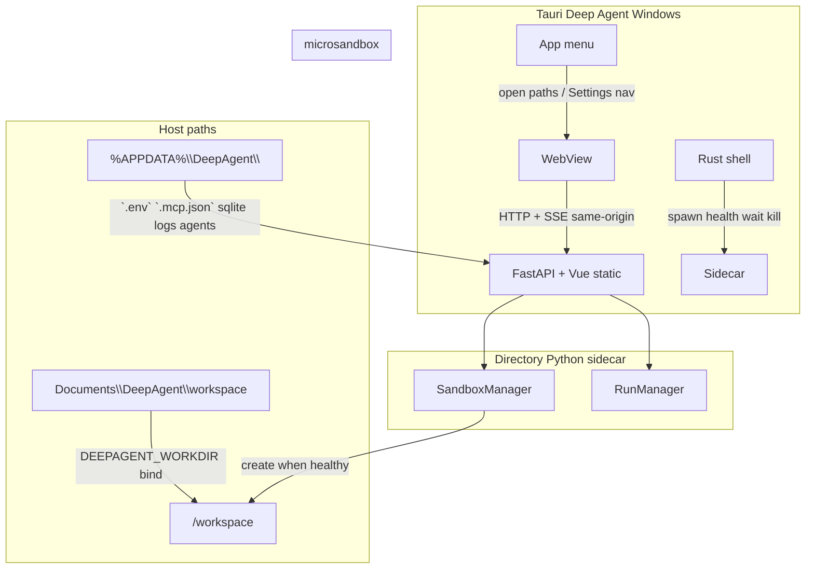

# Tauri desktop migration plan

Agreed design for wrapping the existing FastAPI + Vue GUI + microsandbox stack
in a **Tauri 2** Windows desktop shell.

References:

- [tauri-fastapi-full-stack-template](https://github.com/fudanglp/tauri-fastapi-full-stack-template) — sidecar lifecycle / IPC patterns (not React stack)
- [claude-code-tauri-skills](https://github.com/dchuk/claude-code-tauri-skills) — Tauri v2 checklists (reference only)
- [docs/microsandbox-migration.md](./microsandbox-migration.md) — existing VM / workspace decisions (unchanged)

**Status:** Decision record agreed. **Phase 0–3 implemented** (Tauri shell, desktop Python paths, Windows packaging). Phase 4 optional.

---

## Decision record

| # | Topic | Choice |
|---|--------|--------|
| 1 | Migration ambition | **Hybrid** — Tauri + FastAPI sidecar now; keep Vue GUI; defer React rewrite |
| 2 | Phase 1 platforms | **Windows only** (WHP); keep code portable for later macOS/Linux |
| 3 | Python packaging | **Directory sidecar** — portable CPython + site-packages (not PyInstaller single-file) |
| 4 | Who serves UI | **FastAPI** serves `frontend/`; WebView opens `http://127.0.0.1:<port>/` |
| 5 | Data layout | **Split** — AppData for DB/config; Documents workspace by default |
| 6 | Secrets | **AppData `.env`** (+ in-app settings UI to edit key) |
| 7 | Guest image | **Pull on first use** (`python:3.12-slim` default); clear preparing UI |
| 8 | Listen address/port | **`127.0.0.1:8010` preferred**, fallback to free port; never `0.0.0.0` in phase 1 |
| 9 | Frontend CDNs | **Vendor** JS/CSS (and fonts) into `frontend/` for offline chrome |
| 10 | Other entrypoints | **Desktop-primary**; keep browser `uvicorn` + CLI for dev/debug |
| 11 | Virt failure UX | **Degraded shell** — UI opens with setup guidance |
| 12 | Chat without sandbox | **No sandbox tools** — chat (+ optional MCP) only until VM healthy |
| 13 | Dist artifacts | **NSIS** (+ portable zip of release exe in Phase 3; Tauri v2 has no `portable` bundle target) |
| 14 | Dev workflow | **Browser-first**; Tauri when touching shell; optional production-like smoke |
| 15 | Native surface | **Light desktop** — window, sidecar lifecycle, menu (Quit, Open workspace, Open AppData, Settings) |
| 16 | Identity | **Deep Agent** / `com.deepagent.app` |
| 17 | Scaffold | **`create-tauri-app`**, then wire directory sidecar |
| 18 | Scaffold frontend | **Stub only** — product UI remains FastAPI-served Vue |
| 19 | Settings UI | **In-app Vue panel** writing AppData `.env` (+ menu “Open config folder”) |
| 20 | MCP config | **AppData `.mcp.json`** (`DEEPAGENT_MCP_CONFIG` override still works) |
| 21 | Auto-update | **None** in phase 1 |
| 22 | Fonts | **Vendor** Geist (or equivalent) with UI |
| 23 | Paths | Config/DB: `%APPDATA%\DeepAgent\` · Workspace: `%USERPROFILE%\Documents\DeepAgent\workspace` |
| 24 | Tauri layout | Official **`src-tauri/`** at repo root |
| 25 | JS package manager | **pnpm** |
| 26 | Sidecar Python build | **Embeddable CPython** + sync deps into `sidecar/` at package time |
| 27 | Single-instance | **Yes** — second launch focuses existing; one sidecar / one shared VM |
| 28 | Agents TOML | **Copy defaults into AppData on first run** (user-editable) |
| 29 | Logging | **File under AppData `logs\`** + optional console |
| 30 | CI | **Local `tauri build` only** in phase 1 |
| 31 | Design doc | This file |
| 32 | Skills repo | **Reference only** while implementing |
| 33 | Close window | **Quit app + stop sidecar** (no tray) |

---

## Architecture

**Process model** (inspired by the FastAPI+Tauri template):

| Direction | Method | Phase 1 use |
|-----------|--------|-------------|
| WebView → FastAPI | HTTP REST + SSE | Chat, files, settings, health |
| Rust → FastAPI | HTTP health check | Wait until ready before navigating WebView |
| WebView → Rust | Tauri commands / menu | Open workspace, Open AppData, quit |
| FastAPI → Rust | Not required in phase 1 | Skip Unix-socket bridge unless needed later |

---

## Path and env contract (packaged)

| Item | Location |
|------|----------|
| SQLite (`app` / `messages` / `checkpoints`) | `%APPDATA%\DeepAgent\*.sqlite` (or `data\` subdir) |
| `.env` / `.env.local` | `%APPDATA%\DeepAgent\` |
| `.mcp.json` | `%APPDATA%\DeepAgent\.mcp.json` |
| Agent TOML defaults | Copied to `%APPDATA%\DeepAgent\agents\` on first run |
| Sidecar / app logs | `%APPDATA%\DeepAgent\logs\` |
| Workspace | `%USERPROFILE%\Documents\DeepAgent\workspace` |
| Sidecar runtime | Install dir `sidecar\` (embeddable CPython + packages) |

Dev/browser mode keeps today’s repo-relative defaults (`./data`, `./workspace`, repo `.env`) unless env overrides are set.

`load_app_env()` must load AppData dotenv when running packaged (detect via env flag set by Tauri, e.g. `DEEPAGENT_DESKTOP=1`, and/or `DEEPAGENT_DATA_DIR`).

---

## Degraded mode (virtualization / msb failure)

1. Sidecar **starts** even if microsandbox cannot create a VM.
2. Health/config API reports sandbox status + fix-it text (WHP, `msb doctor`, etc.).
3. UI shows a setup banner/screen; user can still open Settings and chat.
4. Agent is built **without** sandbox filesystem/shell tools until sandbox is healthy.
5. Optional MCP tools may still load.
6. When sandbox becomes available (retry), enable full agent tools (session recreate or explicit reconnect as needed).

Do **not** use production `stub` sandbox for this path (host execution undermines the isolation story).

---

## Dev workflow

| Mode | How |
|------|-----|
| Daily agent/UI | `uv run uvicorn` + browser (unchanged) |
| Shell work | FastAPI in one terminal; `pnpm tauri dev` opens WebView to loopback URL |
| Production-like smoke | Tauri spawns directory sidecar (same as packaged) |
| CLI | `src/cli.py` remains supported for debug |

---

## Implementation phases

### Phase 0 — Doc + scaffolding

- [x] Agree decisions (this doc)
- [x] `pnpm create tauri-app` (or equivalent) at repo root → `src-tauri/`
- [x] Stub/minimal scaffold frontend; configure window to load sidecar URL in desktop mode
- [x] Product name / identifier: Deep Agent / `com.deepagent.app`

### Phase 1 — Sidecar lifecycle (dev)

- [x] Rust: spawn/kill directory Python, preferred port 8010 + fallback, health wait
- [x] Single-instance plugin/behavior
- [x] App menu: Quit, Open workspace, Open AppData, Settings (navigate WebView)
- [x] Pass `DEEPAGENT_DESKTOP`, data dir, workdir into sidecar env

### Phase 2 — App path / desktop awareness (Python + Vue)

- [x] Resolve AppData + Documents defaults when desktop
- [x] Load AppData `.env`; settings API + Vue panel for API key / model
- [x] AppData `.mcp.json` search path
- [x] First-run copy of `agents/` into AppData
- [x] Degraded sandbox startup + status API; agent without sandbox tools
- [x] Vendor CDN JS/CSS + fonts into `frontend/` (Tailwind CDN kept — see `frontend/vendor/README.md`)
- [x] File logging under AppData `logs\`

### Phase 3 — Windows packaging

- [x] Package script: embeddable CPython + locked deps → `sidecar/` (`scripts/package-sidecar.ps1` / `pnpm package:sidecar`)
- [x] Bundle frontend static + agents defaults + sidecar into Tauri resources (`tauri.conf.json` → `$RESOURCE/sidecar/`; frontend/agents copied into sidecar layout)
- [x] `tauri build` → NSIS (+ portable zip of release exe + resources); unsigned. Note: Tauri v2 `bundle.targets` has no `portable` enum — `scripts/package-portable.ps1` / `pnpm package:portable` (or `pnpm build:release`)
- [x] Smoke (non-GUI): packaged `api:app` import + brief uvicorn `/health`. Full install / image-pull / chat / sandbox exec needs interactive virt (WHP); degraded mode remains the designed path when virt fails — do not use stub as production degraded.
- [x] Packaged spawn uses `resources/sidecar/python.exe -m uvicorn`; `tauri dev` keeps `uv run` fallback

### Phase 4 — Polish (optional, after ship)

- [ ] Code signing, auto-update, CI Windows artifacts
- [ ] macOS / Linux shells
- [ ] PyInstaller single-file experiment
- [ ] React/modern frontend rewrite
- [ ] Bundle preloaded guest image

---

## Out of scope (phase 1)

- React / TanStack rewrite
- PyInstaller single binary as primary
- macOS / Linux installers
- Auto-update / code signing
- Tray / close-to-tray
- FastAPI ↔ Rust Unix socket bridge
- Shipping a preloaded OCI guest image
- GitHub Actions release pipeline
- Exposing the API on LAN

---

## Security notes

- Loopback-only HTTP; no auth on the local API — do not bind `0.0.0.0`.
- API keys in AppData `.env` (plaintext); acceptable for single-user phase 1; keyring later if needed.
- CSP / Tauri capabilities: allow WebView to reach loopback sidecar only; follow Tauri v2 capability least-privilege (skills checklists).
- Microsandbox isolation story unchanged when healthy; degraded mode must not silently exec on host via stub.

---

## Implementation todos (when confirmed)

1. Scaffold Tauri 2 with pnpm; stub frontend; set identity.
2. Implement sidecar spawn/health/port fallback/single-instance/menu.
3. Desktop path + env loading; settings + MCP AppData; agents first-run copy.
4. Degraded sandbox + tool-less chat; sandbox status in UI.
5. Vendor frontend assets/fonts; AppData logging.
6. Sidecar package script + NSIS/portable build; README update.
7. Keep browser + CLI documented as supported for debug.
